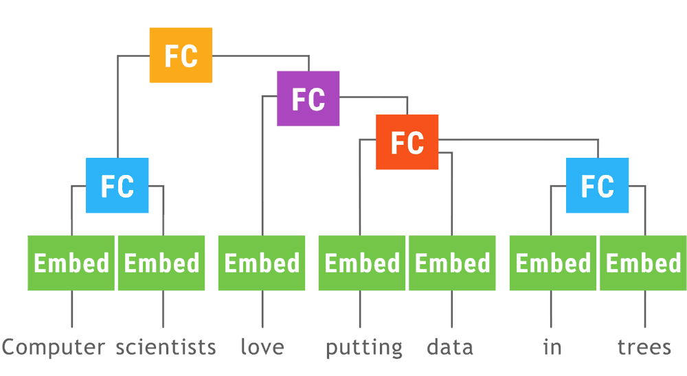

# MXNet Gluon Dynamic-batching
This repository includes an experimental implementation of Fold, a helper for [*dynamic batching*](https://arxiv.org/abs/1702.02181).

This animation from [Tensorflow Fold](https://github.com/tensorflow/fold) shows a [recursive neural network](https://en.wikipedia.org/wiki/Recursive_neural_network) run with dynamic batching. Operations of the signature at the same depth in the computation graph (indicated by color in the animiation) are batched together regardless of whether or not they appear in the same sample.

## Performance

The following results are obtained from MXNet Gluon implementation of [treelstm.pytorch](https://github.com/dasguptar/treelstm.pytorch), which can be found in [example/tree_lstm](https://github.com/szha/mxnet-fold/tree/master/example/tree_lstm) folder . It implements Child-sum Tree-LSTM by [Tai et al.](https://arxiv.org/abs/1503.00075) on the semantic-relatedness task on SICK dataset. We run both [treelstm.pytorch](https://github.com/dasguptar/treelstm.pytorch) and [tree_lstm](https://github.com/szha/mxnet-fold/tree/master/example/tree_lstm), and compare the throughput (i.e samples per second).

Evaluation platforms are:
- EC2 [c4.8xlarge](https://aws.amazon.com/ec2/instance-types/#c4) with
  - CPU: Intel Xeon E5-2666 v3 (Haswell) processors
- EC2 [P2.xlarge](https://aws.amazon.com/ec2/instance-types/#p2) with
  - CPU: Intel Xeon E5-2686v4 (Broadwell) Processors
  - GPU: NVIDIA K80 GPU
  - CUDA 8
- Both on Ubuntu 16.04

The following speed benchmark is performed with the following settings:
- Batch size: 256
- Pytorch:
  - [0.2.0.post3](http://download.pytorch.org/whl/cu80/torch-0.2.0.post3-cp27-cp27mu-manylinux1_x86_64.whl).
- MXNet:
  - [mxnet-cu80mkl==0.12.0b20171030](https://pypi.python.org/pypi?:action=display&name=mxnet-cu80mkl&version=0.12.0b20171030) for GPU test.
  - [mxnet-mkl==0.12.0b20171030](https://pypi.python.org/pypi?:action=display&name=mxnet-mkl&version=0.12.0b20171030) for CPU test.

#### CPU

The following results are obtained on EC2 [c4.8xlarge](https://aws.amazon.com/ec2/instance-types/#c4) host.

| Implementation                         |     Training     |    Inference     |
|----------------------------------------|------------------|------------------|
| MXNet Gluon w/o Fold                   | 33.77 samples/s  | 50.46 samples/s  |
| MXNet Gluon w/ Fold                    | 201.11 samples/s | 315.54 samples/s |
| PyTorch from source (0.4.0a0+1c1519d)  | 16.88 samples/s  | 129.92 samples/s |
| PyTorch 0.2.0-post3                    | 5.10 samples/s   | 27.41 samples/s  |

#### GPU

The following results are obtained on EC2 [P2.xlarge](https://aws.amazon.com/ec2/instance-types/#p2) host.

| Implementation                         |     Training     |    Inference     |
|----------------------------------------|------------------|------------------|
| MXNet Gluon w/o Fold                   | 26.64 samples/s  | 39.10 samples/s  |
| MXNet Gluon w/ Fold                    | 235.48 samples/s | 296.98 samples/s |
| PyTorch from source (0.4.0a0+1c1519d)  |                  |                  |
| PyTorch 0.2.0-post3                    | 13.38 samples/s  | 42.77 samples/s  |
